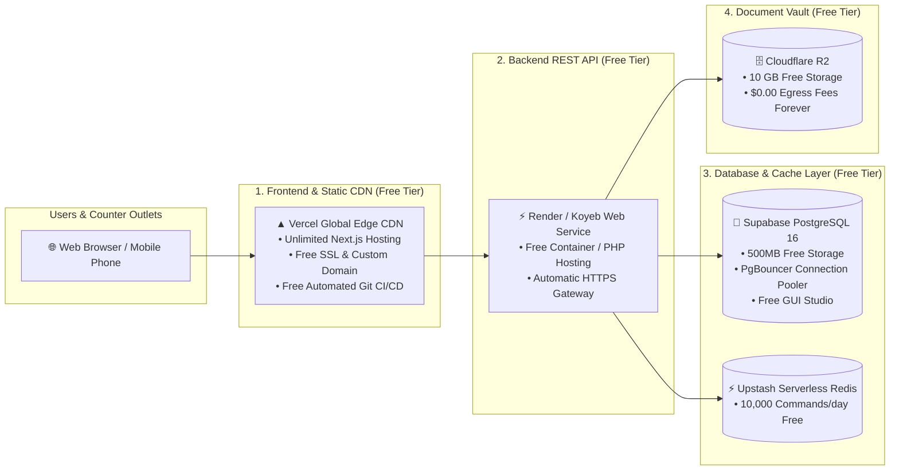

# InfuseTax: 100% Free Permanent Cloud Deployment Guide ($0/month Forever)

This guide walks you through deploying **InfuseTax** permanently to the cloud using the industry's most reliable **100% Free Forever Tiers** (Vercel, Supabase, Upstash, and Cloudflare).

---

## 🏗️ Architecture Blueprint ($0.00 / month)



---

## Step 1: Push Code to GitHub (1 Minute)

Initialize your git repository in `/home/prabhu/Learning/Infusetax` and push to GitHub:

```bash
cd /home/prabhu/Learning/Infusetax

# Initialize Git
git init
git add .
git commit -m "feat: complete InfuseTax platform with bespoke UI and Docker stack"

# Add your GitHub repository URL (create a free repo on github.com)
git remote add origin https://github.com/YOUR_GITHUB_USERNAME/InfuseTax.git
git branch -M main
git push -u origin main
```

---

## Step 2: Deploy Frontend on Vercel (2 Minutes - 100% Free)

1. Go to [**vercel.com**](https://vercel.com) and click **Sign Up** (with your GitHub account).
2. Click **"Add New..."** $\rightarrow$ **Project**.
3. Select your **`InfuseTax`** repository from GitHub and click **Import**.
4. In the Project Configuration:
   - **Root Directory**: Click *Edit* and select **`frontend-web`**.
   - **Framework Preset**: `Next.js` (automatically detected).
   - **Build Command**: `npm run build` (default).
   - **Output Directory**: `.next` (default).
5. Click **Deploy**.
6. In ~45 seconds, your site will be live at `https://infusetax.vercel.app` (or your custom domain) with global SSL and CDN!

---

## Step 3: Setup Free PostgreSQL 16 Database on Supabase (2 Minutes - 100% Free)

1. Go to [**supabase.com**](https://supabase.com) and click **Start your project** (Sign in with GitHub).
2. Click **New Project**:
   - **Name**: `InfuseTax-DB`
   - **Database Password**: Enter a secure password (save this).
   - **Region**: Choose `South Asia (Mumbai)` or nearest.
   - **Pricing Plan**: **Free Tier ($0/month)**.
3. Once created, go to **Project Settings** $\rightarrow$ **Database** $\rightarrow$ **Connection parameters**:
   - Copy your `Host`, `Database`, `User`, and `Port` (5432).
4. Go to **SQL Editor** in Supabase and run the schema migrations from [`INFUSETAX_ARCHITECTURE_DOCUMENTATION.md`](file:///home/prabhu/Learning/Infusetax/INFUSETAX_ARCHITECTURE_DOCUMENTATION.md).

---

## Step 4: Setup Free Serverless Redis on Upstash (1 Minute - 100% Free)

1. Go to [**upstash.com**](https://upstash.com) and sign in with GitHub.
2. Click **Create Database**:
   - **Name**: `infusetax-redis`
   - **Type**: `Regional` (choose Mumbai / Singapore)
   - **Plan**: **Free ($0/month - 10k commands/day)**.
3. Copy your `UPSTASH_REDIS_REST_URL` and `UPSTASH_REDIS_REST_TOKEN`.

---

## Step 5: Setup Free Document Vault on Cloudflare R2 (1 Minute - 100% Free)

1. Go to [**dash.cloudflare.com**](https://dash.cloudflare.com) and navigate to **R2**.
2. Click **Create Bucket** $\rightarrow$ Name it `infusetax-documents`.
3. Under **Manage R2 API Tokens**, click **Create API Token**:
   - Permissions: `Admin Read & Write`.
   - Copy `Access Key ID` and `Secret Access Key`.

---

## Step 6: Deploy Backend API on Render / Koyeb (2 Minutes - 100% Free)

1. Go to [**render.com**](https://render.com) and sign in with GitHub.
2. Click **New +** $\rightarrow$ **Web Service**.
3. Connect your **`InfuseTax`** GitHub repository.
4. Settings:
   - **Name**: `infusetax-api`
   - **Environment**: `Docker`
   - **Docker Command / Path**: `./docker/php/Dockerfile` (or use PHP Native).
   - **Instance Type**: **Free ($0.00/mo)**.
5. Add your Environment Variables (from `backend/.env.production.example`):
   - `DB_HOST`, `DB_DATABASE`, `DB_USERNAME`, `DB_PASSWORD` (from Supabase).
   - `REDIS_HOST`, `REDIS_PASSWORD` (from Upstash).
   - `AWS_ACCESS_KEY_ID`, `AWS_SECRET_ACCESS_KEY` (from Cloudflare R2).
6. Click **Create Web Service**.

---

## Summary of Ongoing Costs:

| Service | Provider | Monthly Cost | What You Get |
| :--- | :--- | :--- | :--- |
| **Frontend Web & Mobile API** | **Vercel** | **$0.00** | Unlimited Next.js builds, Global Edge CDN, Free SSL |
| **Relational Database** | **Supabase** | **$0.00** | Full PostgreSQL 16, 500MB DB, Connection Pooling |
| **In-Memory Cache & Queues** | **Upstash** | **$0.00** | 10,000 Redis commands/day |
| **Document Storage (KYC/PDF)** | **Cloudflare R2** | **$0.00** | 10GB S3-compatible storage with $0 egress fees |
| **Backend Compute** | **Render / Koyeb** | **$0.00** | Free container web service with auto SSL |
| **TOTAL MONTHLY EXPENSE** | | **$0.00 / month** | **100% Free Production Architecture** |

---

*Compiled for **InfuseTax** Platform Deployment.*
