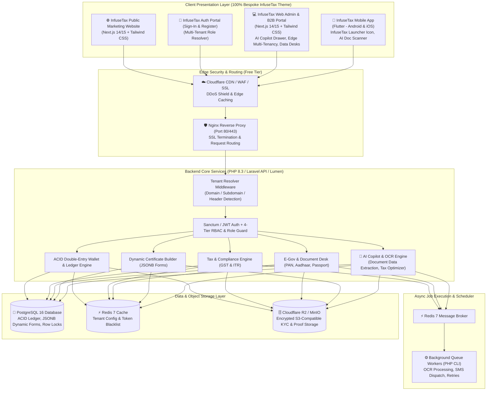
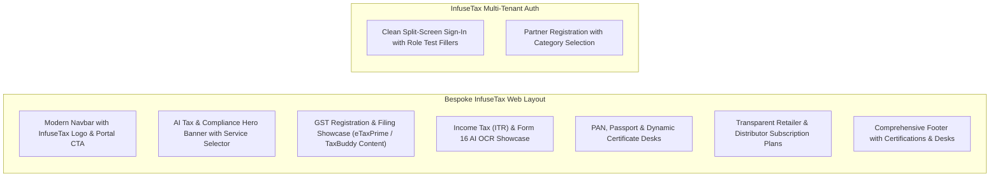
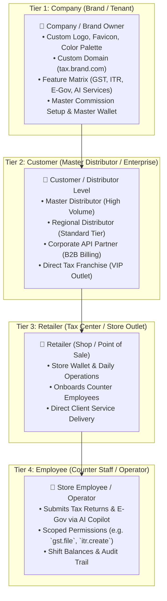
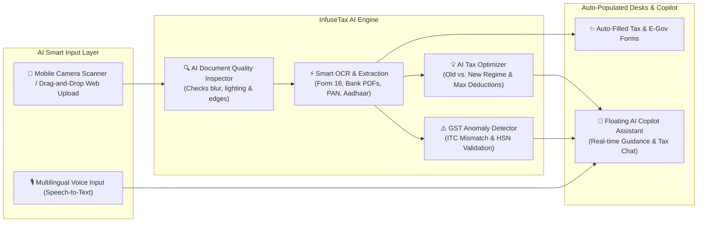
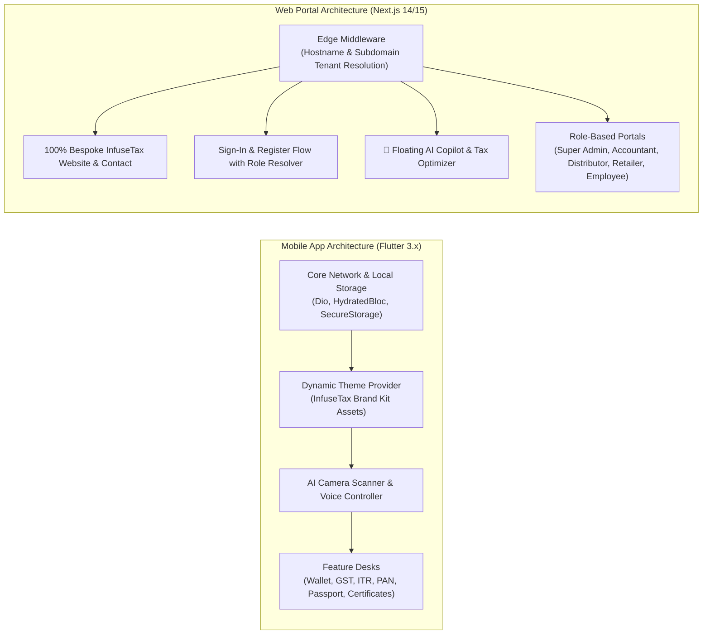
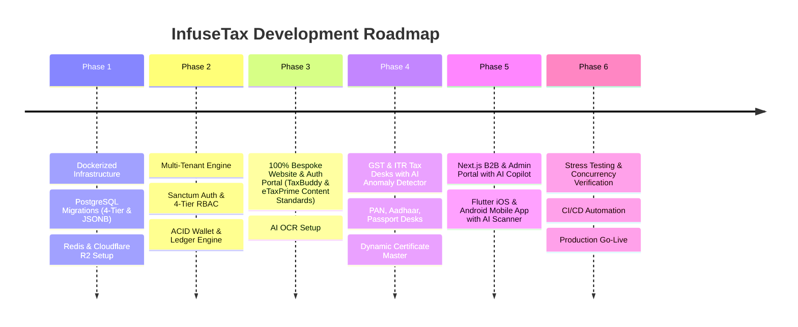

# InfuseTax: Comprehensive Technical Architecture, Multi-Tenant Engine & Deployment Specification

> **Platform Version**: 2.0 (Modernized Architecture)  
> **Product Name**: **InfuseTax**  
> **Target Deployments**: Mobile (Android & iOS via Flutter) & Web (Public Website, Login, Admin & B2B Portals via Next.js)  
> **Backend Architecture**: RESTful API (PHP 8.3 / Laravel 11 API Skeleton or Lumen)  
> **Frontend Web Architecture**: 100% Bespoke, Clean, Custom-Crafted Next.js 14/15 + Tailwind CSS (No Third-Party Template Artifacts)  
> **Content Benchmarks & Reference Standards**: Modeled after leading tax authorities and platforms (**TaxBuddy** GST Filing & **eTaxPrime** GST Registration)  
> **Brand Identity & Assets**: **InfuseTax Brand Kit** located at [`/home/prabhu/Learning/Infusetax/InfuseTax_Brand_Kit Logo/`](file:///home/prabhu/Learning/Infusetax/InfuseTax_Brand_Kit%20Logo/)  
> **AI Engine**: AI-Powered Document OCR, Smart Tax Optimizer Copilot & GST Anomaly Detection  
> **Database Engine**: PostgreSQL 16+ (ACID Double-Entry Ledger, Row-Level Locking & JSONB)  
> **Infrastructure & DevOps**: Multi-Container Docker Stack, Nginx Reverse Proxy, Redis 7, Cloudflare Free Tier & R2 (Zero-Egress Storage)  
> **Target Hosting Cost**: **$5.00 – $10.00 / month** (Single VPS Deployment)

---

## Table of Contents
1. [Executive Summary & System Architecture](#1-executive-summary--system-architecture)
2. [Brand Kit Assets & Application Mapping Guide](#2-brand-kit-assets--application-mapping-guide)
3. [Tax Compliance & GST Standards (TaxBuddy & eTaxPrime Reference)](#3-tax-compliance--gst-standards-taxbuddy--etaxprime-reference)
4. [Bespoke Public Website & Authentication Architecture](#4-bespoke-public-website--authentication-architecture)
5. [4-Tier Multi-Tenant Hierarchy & Customer Classification Engine](#5-4-tier-multi-tenant-hierarchy--customer-classification-engine)
6. [Comprehensive Role-Based Access Control (RBAC) & Permission Matrix](#6-comprehensive-role-based-access-control-rbac--permission-matrix)
7. [PostgreSQL Database Schema & Data Models](#7-postgresql-database-schema--data-models)
8. [Complete Module-by-Module Technical Breakdown](#8-complete-module-by-module-technical-breakdown)
9. [AI-Powered Intelligence Engine & Modern AI UI/UX Trends](#9-ai-powered-intelligence-engine--modern-ai-uiux-trends)
10. [Frontend & Mobile App Architecture](#10-frontend--mobile-app-architecture)
11. [Low-Cost Server Infrastructure & Hosting Strategy](#11-low-cost-server-infrastructure--hosting-strategy)
12. [Docker Multi-Container Blueprint & Configuration](#12-docker-multi-container-blueprint--configuration)
13. [Financial Ledger, Concurrency & Security Standards](#13-financial-ledger-concurrency--security-standards)
14. [Third-Party API Integrations & Async Queues](#14-third-party-api-integrations--async-queues)
15. [Implementation Roadmap & Milestones](#15-implementation-roadmap--milestones)

---

## 1. Executive Summary & System Architecture

**InfuseTax** is an enterprise-grade, AI-driven multi-tenant B2B FinTech, Tax Compliance, and E-Governance Super-Platform. It enables retail tax centers, corporate distributors, and enterprises with pre-funded digital wallets, double-entry financial ledgering, automated tax filing (GST & ITR), dynamic document processing desks, and modern AI Copilot capabilities (intelligent OCR extraction, smart tax optimization, and multilingual voice assistance).



---

## 2. Brand Kit Assets & Application Mapping Guide

All official brand identity files are located in the repository at [`InfuseTax_Brand_Kit Logo/`](file:///home/prabhu/Learning/Infusetax/InfuseTax_Brand_Kit%20Logo/).

```mermaid
graph TD
    subgraph BrandKit["InfuseTax Brand Kit Directory"]
        WebFolder["📁 web/"]
        AppFolder["📁 app/"]
        FaviconFolder["📁 favicon/"]
        SocialFolder["📁 social/"]
        PrintFolder["📁 print/"]
    end

    subgraph WebTargets["Web & Portal Targets"]
        DesktopHeader["Website Desktop Header (800x300 / 600x200)"]
        MobileHeader["Website Mobile Header (300x100)"]
        Wordmark["Compact Navbar Wordmark (400x110)"]
        Favicon["Browser Favicon (.ico & 32x32)"]
        OG["Social Open Graph (1200x630)"]
    end

    subgraph AppTargets["Mobile (Flutter) Targets"]
        AndroidLauncher["Android Mipmap Icons (48 to 192px)"]
        iOSLauncher["iOS AppIcon (120, 152, 180, 1024px)"]
        Splash["Splash Screen Logo (SVG / 512px)"]
    end

    subgraph DocTargets["PDF & Invoice Targets"]
        TaxReceipt["GST & ITR Receipt Header (Print / 1200x400)"]
    end

    WebFolder --> DesktopHeader & MobileHeader & Wordmark
    FaviconFolder --> Favicon
    SocialFolder --> OG
    AppFolder --> AndroidLauncher & iOSLauncher & Splash
    PrintFolder --> TaxReceipt
```



---

## 3. Tax Compliance & GST Standards (TaxBuddy & eTaxPrime Reference)

InfuseTax adopts the standard compliance workflows, documentation requirements, and filing mechanisms of leading platforms like **TaxBuddy** and **eTaxPrime**:

### 1. GST Registration Workflow & Requirements (eTaxPrime Standard)
- **Eligibility Thresholds**:
  - **Goods Suppliers**: Annual Turnover > ₹40 Lakhs (Normal States) / ₹20 Lakhs (Special Category States).
  - **Service Providers**: Annual Turnover > ₹20 Lakhs (Normal States) / ₹10 Lakhs (Special Category States).
  - **Mandatory Cases**: E-Commerce Sellers, Inter-State Suppliers, Casual Taxable Persons, Reverse Charge Mechanism (RCM).
- **Entity Types Supported**:
  - Sole Proprietorship, Partnership Firm, Limited Liability Partnership (LLP), Private Limited Company (Pvt Ltd), One Person Company (OPC), Trust/Society.
- **Mandatory Documents Matrix**:
  - PAN Card of Business / Proprietor / Directors.
  - Aadhaar Card with active mobile linkage for e-KYC.
  - Proof of Business Registration (Incorporation Certificate, Partnership Deed, MSME/Udyam).
  - Principal Place of Business Address Proof (Electricity Bill, Municipal Tax Receipt, Rent Agreement + Landlord NOC).
  - Bank Account Proof (Cancelled Cheque, Bank Statement, or First Page of Passbook).
- **Process Lifecycle**:
  1. Retailer captures applicant details & uploads proofs via InfuseTax Desk.
  2. System generates Temporary Reference Number (TRN).
  3. Aadhaar OTP e-Sign verification.
  4. Application Reference Number (ARN) tracking.
  5. 15-digit GSTIN Certificate issuance in 3 to 7 working days.

### 2. GST Return Filing Engine (TaxBuddy Standard)
- **Supported Return Types**:
  - **GSTR-1**: Monthly (Due 11th) / Quarterly QRMP (Due 13th) details of outward supplies (B2B, B2C Large, B2C Small, Exports, HSN Summaries).
  - **GSTR-3B**: Monthly summary return (Due 20th) of outward supplies, input tax credit (ITC) claims, reverse charge liabilities, and net cash tax payments.
  - **CMP-08**: Quarterly statement for Composition Scheme taxpayers.
  - **GSTR-9 & GSTR-9C**: Annual GST Return and CA Reconciliation Statement.
  - **IFF (Invoice Furnishing Facility)**: For quarterly filers to pass on ITC to B2B buyers monthly.
- **AI-Powered Input Tax Credit (ITC) Reconciliation**:
  - Auto-matches purchase registers against GSTR-2B to flag missing invoices, ineligible ITC, or supplier default before filing GSTR-3B.

---

## 4. Bespoke Public Website & Authentication Architecture

All website components, CSS, and layouts are **100% custom-crafted proprietary InfuseTax code**, containing zero third-party template names, authors, or external vendor tags:



---

## 5. 4-Tier Multi-Tenant Hierarchy & Customer Classification Engine

InfuseTax isolates data, wallets, and operations across a 4-tier organizational hierarchy:



---

## 6. Comprehensive Role-Based Access Control (RBAC) & Permission Matrix

| Hierarchy Level | Role Name | Allowed Modules & Actions | Restricted Actions |
| :--- | :--- | :--- | :--- |
| **Tier 1: Company** | **Super Admin** | Full access to Company branding, master commission plan, API gateway keys, UTR approvals, user role management, system audit logs. | None (Tenant Super-User) |
| **Tier 1: Company** | **Company Accountant** | Financial ledger audit, manual bank top-up (UTR) approvals/rejections, commission settlement, payment gateway reconciliation. | Cannot alter branding or delete users |
| **Tier 1: Company** | **Sales Executive** | Onboard new Customers & Retailers, view sales performance, track referral links. | No access to financial ledger approval |
| **Tier 1: Company** | **Support Executive** | Review and process E-Gov documents (PAN, Aadhaar, Passport), upload acknowledgment slips, resolve filing queries. | No wallet debit/credit authority |
| **Tier 2: Customer** | **Customer Admin** | Onboard downline Retailers, allocate wallet balance (`share_money`), view network transaction reports, set retailer credit limits. | No access to Company-level configurations |
| **Tier 2: Customer** | **Customer Finance** | Monitor downline retailer balances, reconcile cash collections from stores. | Cannot create or delete retailers |
| **Tier 3: Retailer** | **Store Owner / Manager** | Full access to Store Wallet, all tax desks (GST, ITR, E-Gov), create/manage Store Employees, view store commission earnings. | Cannot access other stores' data |
| **Tier 4: Employee** | **Counter Operator** | Execute service requests (GST/ITR filing, PAN, Passport submissions) with AI OCR assistance; print receipts; view own shift logs. | **Strictly prohibited** from withdrawing funds, viewing store owner profits, or modifying store settings. |

---

## 7. PostgreSQL Database Schema & Data Models

### 1. `companies` (Tenant Master & White-Label)
```sql
CREATE TABLE companies (
    id BIGSERIAL PRIMARY KEY,
    uuid UUID DEFAULT gen_random_uuid() UNIQUE,
    name VARCHAR(255) NOT NULL,
    code VARCHAR(50) NOT NULL UNIQUE,
    domain VARCHAR(255) UNIQUE,
    subdomain VARCHAR(100) UNIQUE,
    logo_url VARCHAR(500) DEFAULT '/brand/infusetax_logo_600x200.png',
    favicon_url VARCHAR(500) DEFAULT '/brand/favicon.ico',
    brand_colors JSONB DEFAULT '{"primary": "#1E40AF", "secondary": "#F59E0B", "accent": "#10B981"}'::jsonb,
    sms_sender_id VARCHAR(20),
    invoice_settings JSONB DEFAULT '{"show_gst": true, "footer_text": "Thank you for using InfuseTax"}'::jsonb,
    feature_flags JSONB DEFAULT '{"pan": true, "passport": true, "gst": true, "itr": true, "certificates": true, "ai_ocr": true, "ai_tax_optimizer": true}'::jsonb,
    is_active BOOLEAN DEFAULT TRUE,
    created_at TIMESTAMP WITH TIME ZONE DEFAULT CURRENT_TIMESTAMP,
    updated_at TIMESTAMP WITH TIME ZONE DEFAULT CURRENT_TIMESTAMP
);

CREATE INDEX idx_companies_domain ON companies(domain);
CREATE INDEX idx_companies_subdomain ON companies(subdomain);
```

### 2. `users` (4-Tier Hierarchy & Granular RBAC)
```sql
CREATE TABLE users (
    id BIGSERIAL PRIMARY KEY,
    uuid UUID DEFAULT gen_random_uuid() UNIQUE,
    company_id BIGINT NOT NULL REFERENCES companies(id) ON DELETE RESTRICT,
    parent_user_id BIGINT REFERENCES users(id) ON DELETE SET NULL,
    user_code VARCHAR(50) NOT NULL UNIQUE,
    name VARCHAR(191) NOT NULL,
    email VARCHAR(191) NOT NULL,
    mobile_no VARCHAR(20) NOT NULL,
    password VARCHAR(255) NOT NULL,
    
    hierarchy_tier INT NOT NULL DEFAULT 3, -- 1: Company Staff, 2: Customer, 3: Retailer, 4: Employee
    customer_type VARCHAR(50) DEFAULT NULL, -- 'master_distributor', 'regional_distributor', 'corporate_partner', 'tax_franchise'
    role_type VARCHAR(50) NOT NULL DEFAULT 'retailer',
    permissions JSONB DEFAULT '[]'::jsonb,
    
    address TEXT,
    city VARCHAR(100),
    state VARCHAR(100),
    pincode VARCHAR(10),
    aadhar_no VARCHAR(20),
    pan_no VARCHAR(20),
    is_status INT DEFAULT 1,
    is_verified BOOLEAN DEFAULT FALSE,
    created_at TIMESTAMP WITH TIME ZONE DEFAULT CURRENT_TIMESTAMP,
    updated_at TIMESTAMP WITH TIME ZONE DEFAULT CURRENT_TIMESTAMP
);

CREATE INDEX idx_users_company_id ON users(company_id);
CREATE INDEX idx_users_parent_user_id ON users(parent_user_id);
CREATE INDEX idx_users_hierarchy_tier ON users(hierarchy_tier);
CREATE UNIQUE INDEX idx_users_company_email ON users(company_id, email);
```

### 3. `accounts` & `transactions` (ACID Financial Ledger)
```sql
CREATE TABLE accounts (
    id BIGSERIAL PRIMARY KEY,
    company_id BIGINT NOT NULL REFERENCES companies(id) ON DELETE RESTRICT,
    user_id BIGINT NOT NULL UNIQUE REFERENCES users(id) ON DELETE RESTRICT,
    wallet_amount DECIMAL(14, 2) NOT NULL DEFAULT 0.00 CHECK (wallet_amount >= 0.00),
    locked_amount DECIMAL(14, 2) NOT NULL DEFAULT 0.00 CHECK (locked_amount >= 0.00),
    credit_limit DECIMAL(14, 2) NOT NULL DEFAULT 0.00,
    status INT DEFAULT 0,
    updated_at TIMESTAMP WITH TIME ZONE DEFAULT CURRENT_TIMESTAMP
);

CREATE TABLE transactions (
    id BIGSERIAL PRIMARY KEY,
    uuid UUID DEFAULT gen_random_uuid() UNIQUE,
    company_id BIGINT NOT NULL REFERENCES companies(id) ON DELETE RESTRICT,
    user_id BIGINT NOT NULL REFERENCES users(id) ON DELETE RESTRICT,
    account_id BIGINT NOT NULL REFERENCES accounts(id) ON DELETE RESTRICT,
    operator_user_id BIGINT REFERENCES users(id),
    service_id INT NOT NULL, -- 1: Topup, 2: GST Reg, 3: GSTR Filing, 4: ITR Filing, 5: PAN, 6: Passport, 7: Certificate
    reference_id VARCHAR(100),
    trans_type VARCHAR(10) NOT NULL, -- 'CREDIT' or 'DEBIT'
    current_amt DECIMAL(14, 2) NOT NULL,
    trans_amt DECIMAL(14, 2) NOT NULL,
    retailer_comm DECIMAL(10, 2) DEFAULT 0.00,
    distributor_comm DECIMAL(10, 2) DEFAULT 0.00,
    company_margin DECIMAL(10, 2) DEFAULT 0.00,
    bal_amt DECIMAL(14, 2) NOT NULL,
    service_desc VARCHAR(255) NOT NULL,
    trans_status INT DEFAULT 1,
    idempotency_key VARCHAR(100) UNIQUE,
    created_at TIMESTAMP WITH TIME ZONE DEFAULT CURRENT_TIMESTAMP
);

CREATE INDEX idx_transactions_user_dt ON transactions(user_id, created_at DESC);
CREATE INDEX idx_transactions_company_dt ON transactions(company_id, created_at DESC);
```

---

## 8. Complete Module-by-Module Technical Breakdown

### Module 1: Tax & Compliance Hub (GST & Income Tax / ITR)
- **GST Registration Desk**:
  - Full support for Proprietorship, Partnership, LLP, and Pvt Ltd.
  - Generates ARN application tracking and uploads final GSTIN Certificate.
- **GST Return Filing Desk (GSTR-1 & GSTR-3B)**:
  - Monthly/quarterly return filings with invoice uploads or Excel ingestion.
  - Integrated with **AI GST Anomaly Detector** to verify Input Tax Credit (ITC) eligibility and flag HSN code mismatches before submission.
- **Income Tax Filing Desk (ITR-1, ITR-2, ITR-4)**:
  - Form 16 / Salary Certificate, Bank Statements, Capital Gains, and Deductions under Chapter VI-A (80C, 80D, 80G).
  - Admin tax desk reviews computations, files returns on the Income Tax portal, and uploads verified **ITR-V Acknowledgment**.

### Module 2: Digital Wallet & Multi-Tier Commission Engine
- **Bank UTR Top-ups**: Retailers submit bank deposit slips and UTR reference; Company Accountant reviews and credits funds with automated double-entry ledger entries.
- **Instant Online Payment Gateway**: Webhook-verified instant top-ups via Atom / Razorpay / TechProcess.
- **Parent-to-Child P2P Transfer**: Distributors instantly disburse wallet liquidity to downline Retailers.
- **Real-Time Commission Splits**: Atomic execution crediting Retailer margin, Distributor override, and Company profit.

### Module 3: E-Governance Desk & Document Vault
- **PAN Card Desk**: New PAN (Form 49A), Correction, and Duplicate PAN with Aadhaar e-KYC proof attachments.
- **Aadhaar Correction Hub**: Demographic updates (Name, DOB, Address).
- **Passport Application Desk**: Fresh, Re-issue, and PCC applications under Normal or Tatkaal schemes. Features a **Batch Excel Export Engine** for administrative bulk filing on the official passport portal.
- **Ration & Voter Card Desks**: Additions, deletions, and address modifications.

### Module 4: Dynamic Certificate Engine
- Super Admin configures custom government certificates (e.g. Income, Community, Native, Legal Heir).
- Dynamically renders UI fields and file upload rules on both Web and Mobile apps using JSON Schema.

---

## 9. AI-Powered Intelligence Engine & Modern AI UI/UX Trends



---

## 10. Frontend & Mobile App Architecture



---

## 11. Low-Cost Server Infrastructure & Hosting Strategy

```
┌────────────────────────────────────────────────────────────────────────┐
│                        LOW-COST HOSTING OPTIONS                        │
├───────────────────┬──────────────────────┬─────────────┬───────────────┤
│ Provider          │ Specs                │ Cost / mo   │ Best For      │
├───────────────────┼──────────────────────┼─────────────┼───────────────┤
│ Hetzner Cloud     │ 2 vCPU, 4GB RAM, 40GB│ ~$4.50 - $6 │ ★ #1 Choice   │
│ (CX22 / CPX21)    │ NVMe (EU/US)         │             │ (Best Value)  │
├───────────────────┼──────────────────────┼─────────────┼───────────────┤
│ Contabo           │ 4 vCPU, 6GB RAM, 100GB│ ~$6.00      │ Highest RAM/  │
│ (Cloud VPS S)     │ NVMe (Global)        │             │ CPU per $     │
├───────────────────┼──────────────────────┼─────────────┼───────────────┤
│ DigitalOcean /    │ 2 vCPU, 2GB-4GB RAM  │ $12 - $18   │ Easy UI &     │
│ Linode (Akamai)   │ 50GB SSD             │             │ Global Regions│
├───────────────────┼──────────────────────┼─────────────┼───────────────┤
│ Oracle Cloud      │ 4 ARM vCPU, 24GB RAM │ $0 / FREE   │ ★ Free-Tier   │
│ (Always Free)     │ 200GB Block Storage  │ (Always)    │ (If available)│
└───────────────────┴──────────────────────┴─────────────┴───────────────┘
```

**Total Estimated Monthly Infrastructure Cost**: **~$5 to $10 / month**.

---

## 12. Docker Multi-Container Blueprint & Configuration

### `docker-compose.yml`
```yaml
version: '3.8'

services:
  # 1. Reverse Proxy & Gateway
  nginx:
    image: nginx:alpine
    container_name: infusetax_nginx
    restart: always
    ports:
      - "80:80"
      - "443:443"
    volumes:
      - ./docker/nginx/default.conf:/etc/nginx/conf.d/default.conf
      - ./backend:/var/www/backend:ro
    depends_on:
      - backend
      - frontend

  # 2. Backend REST API (PHP 8.3-FPM / Laravel)
  backend:
    build:
      context: ./docker/php
      dockerfile: Dockerfile
    container_name: infusetax_backend
    restart: always
    volumes:
      - ./backend:/var/www/backend
    environment:
      DB_CONNECTION: pgsql
      DB_HOST: postgres
      DB_PORT: 5432
      DB_DATABASE: infusetax_db
      DB_USERNAME: infusetax_user
      DB_PASSWORD: infusetax_secure_password
      REDIS_HOST: redis
      REDIS_PORT: 6379
      AWS_ACCESS_KEY_ID: ${R2_ACCESS_KEY}
      AWS_SECRET_ACCESS_KEY: ${R2_SECRET_KEY}
      AWS_DEFAULT_REGION: auto
      AWS_BUCKET: infusetax-documents
      AWS_ENDPOINT: ${R2_ENDPOINT_URL}
    depends_on:
      - postgres
      - redis

  # 3. Async Queue Worker (Background Jobs for OCR, Tax Calculations & SMS)
  queue-worker:
    build:
      context: ./docker/php
      dockerfile: Dockerfile
    container_name: infusetax_queue_worker
    restart: always
    command: php /var/www/backend/artisan queue:work --tries=3 --timeout=90
    volumes:
      - ./backend:/var/www/backend
    depends_on:
      - backend
      - redis
      - postgres

  # 4. PostgreSQL 16 Database
  postgres:
    image: postgres:16-alpine
    container_name: infusetax_postgres
    restart: always
    environment:
      POSTGRES_DB: infusetax_db
      POSTGRES_USER: infusetax_user
      POSTGRES_PASSWORD: infusetax_secure_password
    ports:
      - "127.0.0.1:5432:5432"
    volumes:
      - postgres_data:/var/lib/postgresql/data

  # 5. Redis 7 Cache & Queue Broker
  redis:
    image: redis:7-alpine
    container_name: infusetax_redis
    restart: always
    ports:
      - "127.0.0.1:6379:6379"
    volumes:
      - redis_data:/data

  # 6. Web Portal & Public Website (Next.js Standalone with Bespoke Theme & Brand Kit)
  frontend:
    build:
      context: ./frontend-web
      dockerfile: Dockerfile
    container_name: infusetax_frontend
    restart: always
    environment:
      NEXT_PUBLIC_API_URL: https://api.infusetax.com/api/v1
    depends_on:
      - backend

volumes:
  postgres_data:
  redis_data:
```

---

## 13. Financial Ledger, Concurrency & Security Standards

### Pessimistic Concurrency Locking
```php
DB::transaction(function () use ($userId, $amount, $serviceId, $serviceDesc, $idempotencyKey) {
    $account = Account::where('user_id', $userId)->lockForUpdate()->firstOrFail();

    if ($account->wallet_amount < $amount) {
        throw new InsufficientWalletBalanceException("Insufficient balance for this service.");
    }

    $currentBalance = $account->wallet_amount;
    $account->wallet_amount -= $amount;
    $account->save();

    Transaction::create([
        'company_id'      => $account->company_id,
        'user_id'         => $userId,
        'account_id'      => $account->id,
        'service_id'      => $serviceId,
        'trans_type'      => 'DEBIT',
        'current_amt'     => $currentBalance,
        'trans_amt'       => $amount,
        'bal_amt'         => $account->wallet_amount,
        'service_desc'    => $serviceDesc,
        'trans_status'    => 1,
        'idempotency_key' => $idempotencyKey,
    ]);
});
```

---

## 14. Third-Party API Integrations & Async Queues

| Service | Provider | Mechanism | Async/Sync | Fallback Poller |
| :--- | :--- | :--- | :--- | :--- |
| **AI Document OCR Engine** | AI Vision / OCR API | REST API | Async Queue Job | Retry 3 times on timeout |
| **SMS Notifications** | Pay2All API | HTTP GET API | Async Queue Job | Retry 3 times on failure |
| **Online Payment Gateway** | Atom / Razorpay | Webhook & SHA256 Signature | Sync Webhook | Callback verification endpoint |

---

## 15. Implementation Roadmap & Milestones



---

*Documentation compiled and maintained for **InfuseTax Platform**.*
