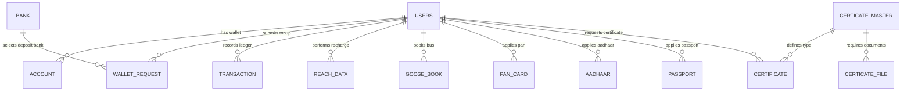
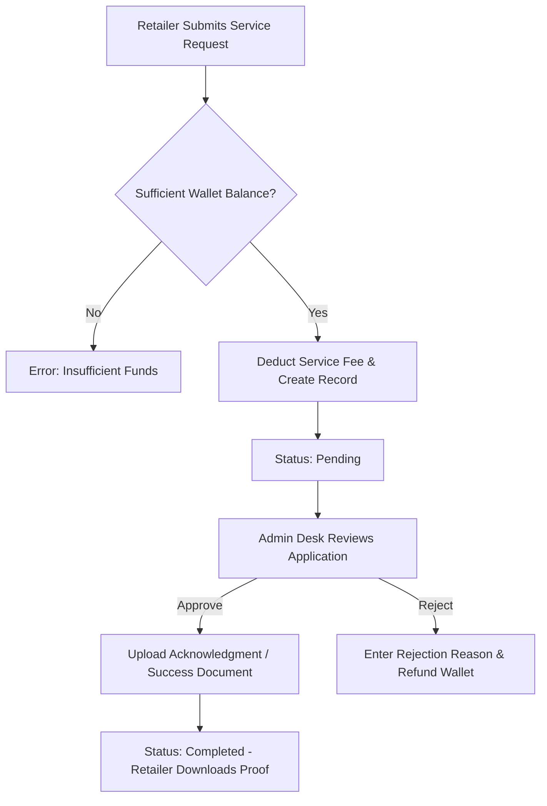

# Complete Technical Documentation & Module-Wise Analysis: iTabWallet (SiviWallet)

> [!NOTE]
> **System Overview**: `itabwallet` (also referred to as SiviWallet) is a comprehensive web-based Digital Wallet, Utility Bill Payment, Mobile/DTH Recharge, Bus Ticketing, Dynamic Certificate Management, and E-Governance Service Platform built on Laravel. It enables Retailers, Distributors, and Admin Staff to manage end-to-end digital services and financial transactions seamlessly.

---

## 1. System Architecture & Tech Stack

### Core Technology Stack
- **Backend Framework**: PHP 7.x / Laravel 5.8 (MVC Architecture)
- **Database**: MySQL / MariaDB (Relational Model with Eloquent ORM)
- **Frontend / Templating**: Blade Engine, JavaScript (jQuery / AJAX), CSS Bootstrap
- **Helper & Utility Layer**: `App\Library\CustomFunctions`, `App\Library\BaseFunction`, `App\Helpers\CustomHelper`
- **File & Asset Storage**: Integrated file server / disk adapter for proof and certificate document uploads (`getCurrentStorageDisk()`)

---

## 2. Authentication, Roles & Security Middleware

The application enforces fine-grained role-based access control (RBAC) across public, retailer, distributor, and internal administrative routes using Laravel Middleware:

| Role ID (`is_admin`) | Role Name | Allowed Middleware | Key Responsibilities |
| :--- | :--- | :--- | :--- |
| **`0`** | **Retailer / End User** | `UserType`, `auth` | Submits service requests, performs recharges, books bus tickets, requests wallet top-ups |
| **`1`** | **Super Admin** | `CheckAdmin`, `auth` | System setup, internal user creation, wallet top-up approvals, service approvals |
| **`2`** | **Accountant** | `CheckAdmin`, `auth` | Financial audit, top-up verification, transaction reporting |
| **`3`** | **Sales Executive** | `CheckAdmin`, `auth` | Retailer onboarding, reference tracking, sales monitoring |
| **`4`** | **Support Executive**| `CheckAdmin`, `auth` | Customer service request resolution, service status updates |
| **Distributor** | **Distributor** | `Distributor`, `auth` | Downline user management, fund allocation |

---

## 3. Database Schema Specification (A to Z Tables)

The database schema consists of 21 core tables managing users, wallet accounts, recharge logs, utility services, e-governance documents, and transaction ledgers.

### Table 1: `users`
*Model: `App\User`*
Stores authentication credentials, personal details, roles, and referral links.

| Field Name | Type | Description |
| :--- | :--- | :--- |
| `id` | BIGINT (PK, Auto) | Primary user identifier |
| `user_id` | VARCHAR(50) | Custom SIVI User ID (e.g., `SIVI001`) |
| `name` | VARCHAR(191) | Full name of the user/retailer |
| `email` | VARCHAR(191) | Email address (unique) |
| `password` | VARCHAR(191) | Hashed password |
| `mobile_no` | VARCHAR(20) | Registered mobile number |
| `gender` | VARCHAR(10) | Gender |
| `dob` | DATE | Date of birth |
| `address` | TEXT | Postal address |
| `city` | VARCHAR(100) | City name |
| `state` | VARCHAR(100) | State name |
| `pincode` | VARCHAR(10) | Postal pincode |
| `profile_image` | VARCHAR(255) | Path to profile avatar |
| `aadhar` | VARCHAR(20) | Aadhaar card number |
| `id_cost` | DECIMAL(10,2) | User account onboarding cost |
| `is_admin` | INT | `0`=Retailer, `1`=Admin, `2`=Accountant, `3`=Sales, `4`=Support |
| `user_type` | INT | User category classification |
| `is_status` | INT | `0`=Pending, `1`=Active, `2`=Blocked |
| `is_verified` | INT | `0`=Unverified, `1`=KYC Verified |
| `referral_id` | VARCHAR(50) | Sponsor / Referral user ID |
| `sivi_ref_id` | VARCHAR(50) | Sivi referral code |
| `created_at` / `updated_at` | TIMESTAMP | System timestamps |

---

### Table 2: `account`
*Model: `App\Model\SiviAccountModel`*
Maintains current digital wallet balances.

| Field Name | Type | Description |
| :--- | :--- | :--- |
| `id` | BIGINT (PK) | Account identifier |
| `user_id` | BIGINT (FK -> `users.id`) | Owner user reference |
| `wallet_amount` | DECIMAL(12,2) | Current available wallet balance |
| `joining_amount` | DECIMAL(12,2) | Initial deposit / registration balance |
| `status` | INT | `0`=Active, `1`=Locked |
| `update_dt` | DATETIME | Last balance update timestamp |

---

### Table 3: `wallet_request`
*Model: `App\Model\SiviWalletRequestModel`*
Tracks top-up requests via manual Bank UTR or online Payment Gateway.

| Field Name | Type | Description |
| :--- | :--- | :--- |
| `id` | BIGINT (PK) | Request identifier |
| `user_id` | BIGINT (FK -> `users.id`) | Requesting user |
| `trans_id` | VARCHAR(50) | Unique Wallet Request Transaction ID (e.g., `WALLET0001`) |
| `bank_id` | BIGINT (FK -> `bank.id`) | Deposit bank reference |
| `utr_ref_no` | VARCHAR(100) | Bank UTR / Reference Transaction Number |
| `payment_type` | INT | `1`=Online PG, `2`=Bank Deposit |
| `payment_status` | VARCHAR(50) | Payment gateway status |
| `amount` | DECIMAL(10,2) | Requested top-up amount |
| `deposit_date` | DATE | Date of bank deposit |
| `status` | INT | `0`=Pending, `1`=Approved & Credited, `2`=Rejected |
| `reason` | TEXT | Rejection remarks |

---

### Table 4: `transaction`
*Model: `App\Model\TransactionModel`*
Central double-entry financial ledger for all credits, debits, commissions, and running balances.

| Field Name | Type | Description |
| :--- | :--- | :--- |
| `id` | BIGINT (PK) | Ledger entry ID |
| `primary_id` | BIGINT | Service reference ID (e.g. `wallet_request.id`, `reach_data.id`) |
| `user_id` | BIGINT (FK -> `users.id`) | Affected user |
| `account_id` | BIGINT (FK -> `account.id`) | Account reference |
| `serivce_id` | INT | Service type classifier ID |
| `current_amt` | DECIMAL(12,2) | Balance before transaction |
| `trans_amt` | DECIMAL(12,2) | Transaction debit or credit amount |
| `commission` | DECIMAL(10,2) | Retailer commission earned |
| `sivi_com` | DECIMAL(10,2) | Admin commission retained |
| `bal_amt` | DECIMAL(12,2) | Resulting balance after transaction |
| `service_desc` | VARCHAR(255) | Transaction description / summary |
| `trans_status` | INT | `1`=Success, `0`=Failed/Reversed |

---

### Table 5: `reach_data`
*Model: `App\Model\RechargeModel`*
Logs Mobile, DTH, and Postpaid recharge transactions.

| Field Name | Type | Description |
| :--- | :--- | :--- |
| `id` | BIGINT (PK) | Recharge transaction ID |
| `user_id` | BIGINT (FK -> `users.id`) | User performing recharge |
| `trans_id` | VARCHAR(50) | Custom transaction reference |
| `rech_type` | INT | `1`=Mobile Prepaid, `2`=DTH, `3`=Postpaid |
| `mobile_no` | VARCHAR(20) | Mobile or Customer DTH ID |
| `operator_name` | VARCHAR(100) | Telecom/DTH Operator Code |
| `amount` | DECIMAL(10,2) | Recharge amount |
| `status` | INT | `0`=Pending, `1`=Success, `2`=Failed |
| `error` | TEXT | Gateway response XML/Message |

---

### Table 6: `eb_bill`
*Model: `App\Model\ElectricityModel`*
Electricity bill collection and processing records.

| Field Name | Type | Description |
| :--- | :--- | :--- |
| `id` | BIGINT (PK) | EB record ID |
| `user_id` | BIGINT (FK) | Requesting user |
| `trans_id` | VARCHAR(50) | Service transaction ID |
| `name` | VARCHAR(100) | EB account holder name |
| `region` | VARCHAR(50) | Electricity circle / region code |
| `service_no` | VARCHAR(50) | Consumer Service Number |
| `due_dt` | DATE | Bill due date |
| `amount` | DECIMAL(10,2) | Payable bill amount |
| `status` | INT | `0`=Pending, `1`=Completed, `2`=Rejected |

---

### Table 7: `goose_book`
*Model: `App\Model\BusModel`*
Bus ticket reservation and PNR tracking details.

| Field Name | Type | Description |
| :--- | :--- | :--- |
| `id` | BIGINT (PK) | Booking record ID |
| `user_id` | BIGINT (FK) | User who booked ticket |
| `trans_id` | VARCHAR(50) | Transaction ID |
| `booking_code` | VARCHAR(100) | Goose API temporary booking code |
| `pnr_no` | VARCHAR(100) | Confirmed bus ticket PNR |
| `transport_name` | VARCHAR(150) | Bus operator name |
| `bus_name` | VARCHAR(100) | Bus model/type |
| `from_place` | VARCHAR(100) | Origin station |
| `to_place` | VARCHAR(100) | Destination station |
| `departure_date` | DATE | Travel date |
| `departure_time` | VARCHAR(20) | Boarding time |
| `board_point` | VARCHAR(255) | Boarding point location |
| `seat_continue` | VARCHAR(100) | Seat numbers reserved |
| `total_fare` | DECIMAL(10,2) | Total ticket fare |
| `confirm_status` | INT | `1`=Confirmed, `2`=Cancelled |

---

### Table 8: `pan_card`
*Model: `App\Model\PanModel`*
PAN Card creation, duplicate, and correction applications.

| Field Name | Type | Description |
| :--- | :--- | :--- |
| `id` | BIGINT (PK) | PAN record ID |
| `user_id` | BIGINT (FK) | User submitting application |
| `pan_type` | VARCHAR(50) | `New`, `Correction`, `Duplicate` |
| `form_file` | VARCHAR(255) | Uploaded physical application form |
| `aadhar_card` | VARCHAR(255) | Uploaded Aadhaar proof |
| `pan_copy` | VARCHAR(255) | Existing PAN copy proof |
| `ack_proof` | VARCHAR(255) | Admin uploaded acknowledgment slip |
| `amount` | DECIMAL(10,2) | Service fee deducted |
| `status` | INT | `0`=Pending, `1`=Completed, `2`=Rejected |

---

### Table 9: `aadhaar`
*Model: `App\Model\AadhaarModel`*
Aadhaar detail update applications.

| Field Name | Type | Description |
| :--- | :--- | :--- |
| `id` | BIGINT (PK) | Aadhaar record ID |
| `user_id` | BIGINT (FK) | User ID |
| `aadhaar_type` | VARCHAR(50) | Correction type (Name/DOB/Address) |
| `name` / `new_name` | VARCHAR(191) | Applicant updated name |
| `new_dob` | DATE | Applicant updated DOB |
| `new_address` | TEXT | Applicant updated address |
| `upload_old_aadhaar_file` | VARCHAR(255) | Existing Aadhaar file path |
| `upload_proofs` | VARCHAR(255) | Supporting identity proof |
| `ack_proof` | VARCHAR(255) | Final processed proof upload |
| `status` | INT | `0`=Pending, `1`=Processed |

---

### Table 10: `passport`
*Model: `App\Model\PassportModel`*
Full Passport Application tracking database (over 30 fields).

| Field Name | Type | Description |
| :--- | :--- | :--- |
| `passport_id` | BIGINT (PK) | Passport record ID |
| `user_id` | BIGINT (FK) | Applicant / Retailer |
| `passport_type` | VARCHAR(50) | `Fresh`, `Re-issue`, `PCC` |
| `type_app` | VARCHAR(50) | `Normal`, `Tatkaal` |
| `app_given_name` | VARCHAR(100) | Given name |
| `surname` | VARCHAR(100) | Surname |
| `place_of_birth` | VARCHAR(100) | City/Town of birth |
| `maritial_status` | VARCHAR(50) | Marital status |
| `employment_type` | VARCHAR(50) | Employment status |
| `police_station` | VARCHAR(150) | Local police station |
| `pcc_for_which_country`| VARCHAR(100) | Destination country for PCC |
| `file_no` | VARCHAR(100) | Government File Reference Number |
| `sucess_file` | VARCHAR(255) | Admin generated appointment/pass output |
| `status` | INT | `0`=Pending, `1`=Approved, `2`=Rejected |

---

### Tables 11-16: Additional Government & Tax Services Schema

- **`ration`** (*Model: `App\Model\RationModel`*): Fields for `family_head_proof`, `mariage_invitation`, `gas_bill`, `ration_card`, `death_certificate`, `ack_proof`.
- **`voter`** (*Model: `App\Model\VoterModel`*): Fields for `voter_type`, `photos`, `10th_12th_marksheet`, `driving_license`, `bank_passbook`, `ack_proof`.
- **`gst`** (*Model: `App\Model\GstRegModel`*): Fields for business name, mobile, email, `upload_gst_file`, `upload_proofs`, `ack_proof`.
- **`gst_fill`** (*Model: `App\Model\GstFillModel`*): Fields for `gst_fill_type`, `gst_id`, `gst_password`, filing period, `ack_proof`.
- **`it_fill`** (*Model: `App\Model\ItFillModel`*): Fields for `upload_aadhar`, `upload_pan`, `upload_form` (Form 16/Bank statements), `ack_proof`.

---

### Dynamic Certificate System Tables (17-19)

- **`certicate_master`** (*Model: `App\Model\CertificateMasterModel`*): Defines dynamic certificate types (e.g., Community Certificate, Income Certificate, Native Certificate). Columns: `route_name`, `name`, `title`, `amount`, `order_by`, `status`, `service_id`.
- **`certicate_file`** (*Model: `App\Model\CertificateFileModel`*): Specifies required document uploads per certificate. Columns: `certificate_id`, `file_name`, `file_type`, `is_mandatory`.
- **`certificate`** (*Model: `App\Model\CertificateModel`*): Stores user-submitted dynamic certificate applications with up to 11 dynamic proof attachments (`proof_1` to `proof_11`).

---

### Supporting Tables (20-21)

- **`share_money`** (*Model: `App\Model\ShareMoneyModel`*): Peer-to-peer / Agent-to-User wallet balance transfer log (`user_id`, `sharing_user_id`, `share_amount`, `status`).
- **`bank`** (*Model: `App\Model\BankModel`*): System master list of approved deposit banks for offline manual wallet top-ups.
- **`auto_increment`** (*Model: `App\Model\AutoIncrementModel`*): System generator maintaining atomic sequential counters for transaction codes across wallet, bus, and document services.

---

## 4. Comprehensive Module-by-Module Breakdown (A to Z)

### Module A: User Management & Authentication
- **Onboarding & Registration**: Supports registration of Retailers, Distributors, and Internal Staff (Admin, Accountant, Sales, Support).
- **Referral Engine**: Tracks parent-child relationships using `referral_id` and `sivi_ref_id`.
- **Account Verification & Status Control**: Admins can verify, activate, block, or modify user roles via `Admin\UserController`.

### Module B: Wallet Engine & Balance Management
- **Manual Top-up Submission**: Users deposit funds via bank transfer and submit bank details along with UTR Reference Number (`utr_ref_no`).
- **Payment Gateway Integration**: Direct redirection to online payment gateway via `TransactionRequestModel`.
- **Admin Verification Workflow**: Admins review pending top-ups (`/approval/access`), verify UTRs, and approve or reject.
- **Automated Ledgering**: Upon approval, the balance is added to `account.wallet_amount`, a ledger entry is created in `transaction`, and an automated SMS is dispatched to the user via **Pay2All API**.

### Module C: Recharge Services Engine
- **Supported Recharges**: Mobile Prepaid, DTH, Mobile Postpaid.
- **API Integration**: Integrates directly with **Vasantham Recharge API** (`https://vasanthamrecharge.com/ebird/api.php`).
- **Execution Flow**:
  1. Retailer enters mobile/DTH number and selects operator.
  2. System checks user balance in `account`.
  3. System initiates HTTP cURL request to Vasantham API.
  4. Response XML parsed; if successful, wallet balance debited and ledger updated.
  5. API status lookup endpoint (`currentStatus.php`) implemented to re-check pending recharges.

### Module D: Electricity (EB) Bill Payment
- **Service Flow**: Retailers submit consumer service numbers and regional circle codes.
- **Processing**: Wallet balance is debited and request logged in `eb_bill`. Admin staff processes payments with the electricity board and uploads receipt/acknowledgment.

### Module E: Travel & Bus Booking Engine
- **API Integration**: Direct integration with **Goose Bus Booking API**.
- **Booking Workflow**:
  1. Station Search: `/bus-book/from_place` & `/bus-book/to_place`.
  2. Bus Lookup: `/bus-book/available-sivi-bus-search` querying Goose API.
  3. Seat Layout: `/bus-book/get-seats-section` retrieves real-time seat matrix.
  4. Temporary Lock: `ticketBooking()` lock seats via Goose temp booking API.
  5. Wallet Deduction & Confirmation: `gooseConfirmBooking()` deducts fare from retailer wallet and confirms booking with Goose API, generating official PNR.
  6. Cancellation Workflow: Supports full or partial seat cancellation via `gooseCancelBooking()`.

### Module F: E-Governance & Document Processing Hub

1. **PAN Card Desk** (`Admin\PanController`): New, Correction, and Duplicate PAN processing with mandatory document attachments (Form 49A, Aadhaar, Proof of Identity).
2. **Aadhaar Correction Hub** (`Admin\AadhaarController`): Demographic updates (Name, Address, DOB, Care Of) with old Aadhaar and proof uploads.
3. **Passport Application Desk** (`Admin\PassportController`): Supports Fresh, Reissue, and PCC applications under Normal or Tatkaal schemes. Features an **Excel Export Engine** (`exportExcel()`) enabling admins to batch-export applicant data for offline passport portal submissions.
4. **Ration Card Desk** (`Admin\RationController`): Modifications, additions, and deletions with supporting gas bills, marriage cards, or death certificates.
5. **Voter ID Desk** (`Admin\VoterController`): Registration and corrections with photo, marksheet, driving license, or passbook uploads.

### Module G: Tax & GST Compliance (GST & IT Filing)
- **GST Registration** (`Admin\GstRegController`): Business details collection, proof upload, processing status.
- **GST Return Filing** (`Admin\GstFillController`): GSTR-1 / GSTR-3B return request collection with GST portal credentials.
- **Income Tax Filing** (`Admin\ItFillController`): Form 16 and income statement submission for annual ITR filing.

### Module H: Dynamic Certificate Engine
- Admin can dynamically create new certificate offerings in `certicate_master` and configure document upload rules in `certicate_file`.
- Retailers select certificate type, system dynamically renders required file inputs, validates mandatory constraints, deducts dynamic service fees, and creates request in `certificate`.

### Module I: Peer-to-Peer Wallet Money Transfer
- Enables distributors or agents to transfer funds directly to downline user wallets via `Admin\ShareMoneyController` using `share_money` logs.

### Module J: Financial Reporting & Audit Trail
- **Transaction Ledger** (`Admin\ReportController`): Real-time lookup of all debits, credits, and commissions with date-range filters (`from_dt`, `to_dt`).
- **Wallet Top-up Audit**: Historical view of approved, pending, and rejected top-ups.

---

## 5. Third-Party API Specifications

| API Name | Provider | Purpose | Endpoints / Specifications |
| :--- | :--- | :--- | :--- |
| **Recharge API** | Vasantham Recharge | Mobile, DTH, Postpaid Recharges | `https://vasanthamrecharge.com/ebird/api.php` `https://vasanthamrecharge.com/ebird/currentStatus.php` |
| **Bus Booking API** | Goose Bus API | Real-time seat layouts, booking, cancellation | Endpoints: `search`, `busmap`, `tempbooking`, `confirmbooking`, `cancel`, `confirmcancel` |
| **SMS Notification API**| Pay2All | Instant SMS dispatches for top-ups & alerts | `https://www.pay2all.in/web-api/send_sms?api_token=...&senderid=SIVIWT` |
| **Payment Gateway** | Atom / TechProcess | Online wallet top-up payment collection | `TransactionRequestModel` integration |

---

## 6. Summary of Architectural Strengths

1. **Modular MVC Design**: Clean segregation between HTTP Controllers, Eloquent Models, and Custom Business Helpers.
2. **Double-Entry Financial Safety**: Strict balance validation before executing recharges or service submissions, preventing negative wallet balances.
3. **Flexible Certificate Master**: Dynamic certificate configuration allows adding new government services without schema migrations or code changes.
4. **Multi-Role Access Guarding**: Robust middleware structure protecting admin, accountant, sales, support, and retailer operations.
